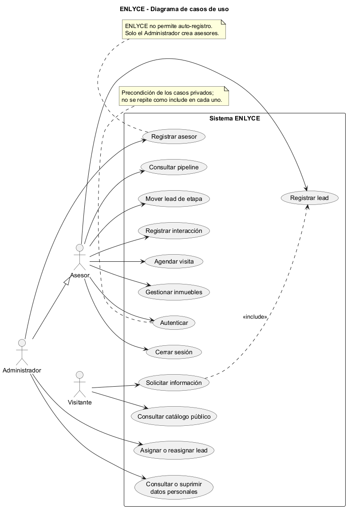
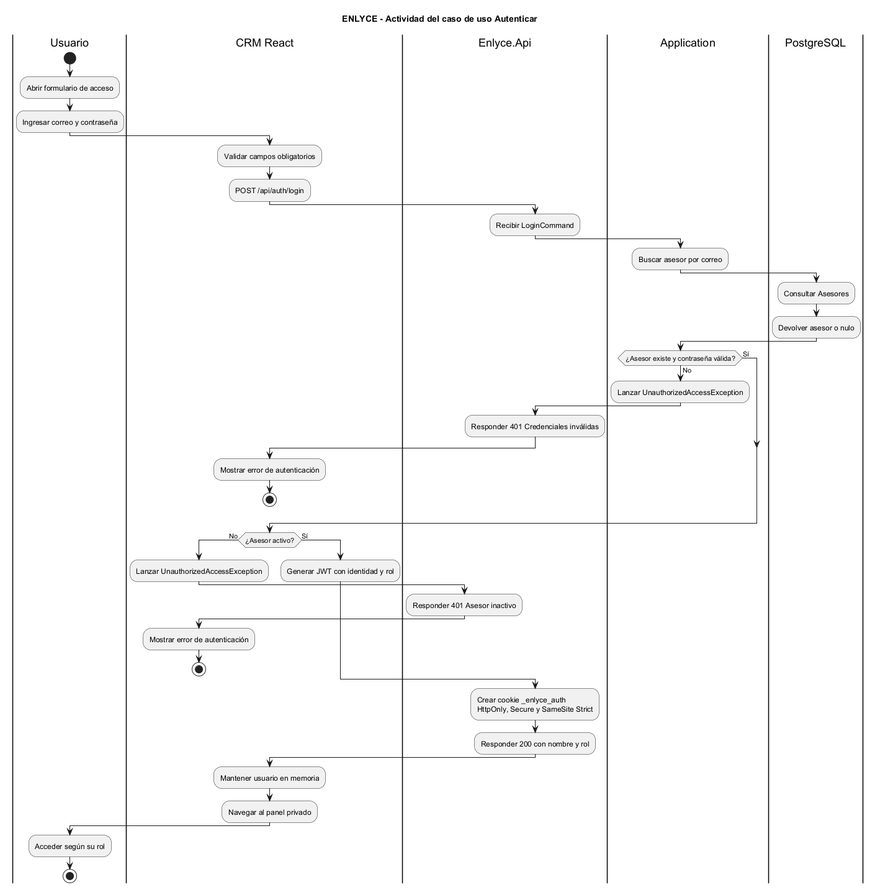
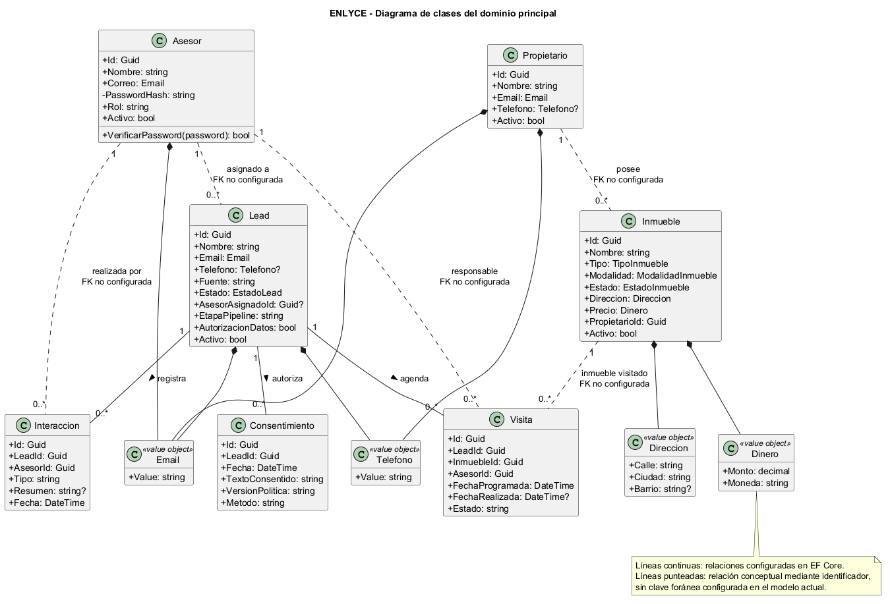

# Taller práctico UML — ENLYCE

**Estudiante:** Samuel Andres Escobar Saldarriaga

**Modalidad:** Trabajo individual

**Ficha, celular y correo:** pendientes de completar por el estudiante

**Proyecto:** ENLYCE — CRM inmobiliario

## Descripción del problema

Las inmobiliarias pequeñas gestionan oportunidades, inmuebles y seguimientos mediante WhatsApp, hojas de cálculo y notas dispersas. Esto provoca pérdida de contactos, duplicidad de atención, poca visibilidad sobre el trabajo de los asesores y dificultades para demostrar el tratamiento autorizado de datos personales. ENLYCE centraliza el proceso comercial: capta interesados, organiza cada oportunidad en un pipeline, asigna responsables, registra interacciones y visitas, publica inmuebles y conserva evidencia de consentimiento.

## Requisitos de usuario

| ID | Actor | Requisito | Criterio observable |
|---|---|---|---|
| RU-01 | Asesor / Administrador | Iniciar y cerrar sesión. | Credenciales válidas crean una sesión segura; cerrar sesión elimina la cookie. |
| RU-02 | Administrador | Registrar asesores. | Solo el rol Administrador puede crear una cuenta con correo único. |
| RU-03 | Visitante / Asesor | Registrar una oportunidad comercial. | El sistema crea el lead o registra un nuevo contacto si el correo ya existe. |
| RU-04 | Administrador | Asignar o reasignar leads. | El lead queda vinculado al asesor seleccionado. |
| RU-05 | Asesor / Administrador | Consultar el pipeline y mover leads. | El tablero muestra las etapas y conserva el cambio realizado. |
| RU-06 | Asesor | Registrar interacciones. | La llamada, mensaje, correo o nota queda asociada al lead y al asesor. |
| RU-07 | Asesor | Programar y consultar visitas. | La visita queda vinculada con lead, inmueble, asesor y fecha. |
| RU-08 | Asesor / Administrador | Gestionar inmuebles. | Los usuarios autorizados pueden registrar y consultar inmuebles. |
| RU-09 | Visitante | Consultar el catálogo público. | El catálogo y la ficha pública se consultan sin autenticación. |
| RU-10 | Titular / Administrador | Gestionar datos personales. | El sistema permite consultar o suprimir datos según autorización y rol. |
| RU-11 | Asesor / Administrador | Consultar alertas de seguimiento. | Cada usuario ve las alertas que corresponden a su alcance. |
| RU-12 | Todos | Acceder solo a operaciones permitidas por el rol. | La API responde 401 sin sesión y 403 sin permiso suficiente. |

## Diagrama de casos de uso

> La guía usa el término “Registrarse”. ENLYCE no permite auto-registro: el Administrador ejecuta el caso de uso **Registrar asesor**.

## Descripción textual de casos de uso

### UC-01 — Autenticar

- **Actor principal:** Asesor o Administrador.
- **Objetivo:** acceder al CRM con la identidad y permisos correspondientes.
- **Precondiciones:** el asesor está registrado y activo.
- **Disparador:** el usuario envía correo y contraseña desde el formulario de acceso.
- **Flujo principal:** el CRM valida campos; envía `POST /api/auth/login`; la API busca el asesor; verifica contraseña y estado; genera el JWT; crea la cookie segura `_enlyce_auth`; responde con nombre y rol; el CRM abre el panel privado.
- **Alternativas:** campos incompletos no se envían; credenciales inválidas producen 401; asesor inactivo produce 401.
- **Postcondiciones:** existe sesión autenticada mediante cookie HttpOnly; el usuario accede según su rol.

### UC-02 — Registrar asesor

- **Actor principal:** Administrador.
- **Objetivo:** crear una cuenta interna para un asesor o administrador.
- **Precondiciones:** el actor inició sesión y posee rol Administrador.
- **Disparador:** el administrador diligencia nombre, correo, contraseña y rol.
- **Flujo principal:** el CRM envía `POST /api/auth/register`; la API verifica autorización; Application valida el correo único; genera el hash BCrypt; crea el asesor activo; persiste la entidad; responde 201 con identificador y nombre.
- **Alternativas:** sin sesión produce 401; rol Asesor produce 403; correo repetido o datos inválidos rechazan la solicitud.
- **Postcondiciones:** el asesor queda registrado y puede autenticarse.

### UC-03 — Registrar lead

- **Actor principal:** Visitante o Asesor.
- **Objetivo:** registrar una oportunidad comercial y su decisión sobre autorización de datos.
- **Precondiciones:** existen nombre y correo válidos; el origen informa si hubo autorización.
- **Disparador:** el interesado solicita información o el asesor registra el contacto.
- **Flujo principal:** la interfaz envía `POST /api/leads`; Application valida correo, teléfono y referencias; busca contactos existentes; crea el lead cuando representa una oportunidad nueva; registra consentimiento si fue autorizado y existe política activa; envía confirmación; la API responde 201.
- **Alternativas:** datos inválidos producen 400; un contacto repetido sobre la misma oportunidad actualiza el contador y puede registrar una interacción sin duplicar el lead; una publicación diferente crea otra oportunidad.
- **Postcondiciones:** queda una oportunidad nueva o un recontacto trazable; el consentimiento queda vinculado cuando corresponde.

## Diagrama de actividad — Autenticar

## Diagrama de clases

Las líneas continuas representan relaciones configuradas en EF Core. Las líneas punteadas representan relaciones conceptuales implementadas mediante identificadores, pero sin clave foránea configurada actualmente.

## Base de verificación

Documento contrastado contra `src/`, configuraciones EF Core, endpoints y pruebas de ENLYCE en el commit `dc24b37`, el 2026-09-24. Los cambios locales aún no versionados del módulo administrativo de publicaciones no forman parte de estos diagramas.
