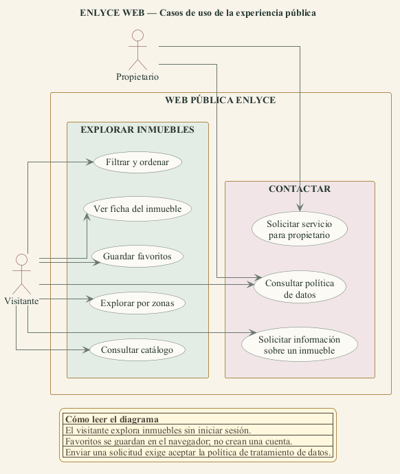
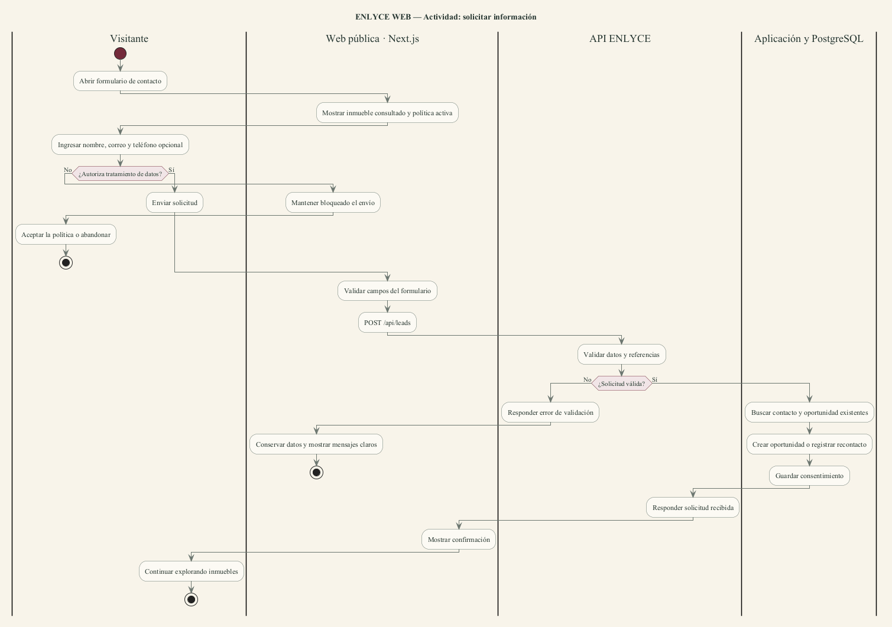
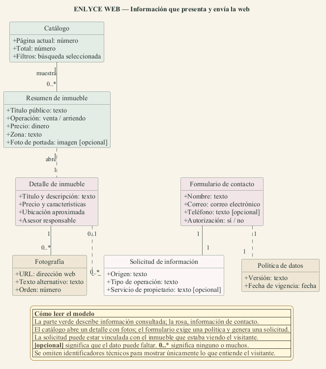
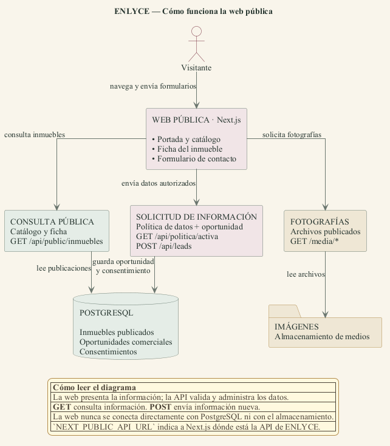

# Taller práctico UML — Web pública de ENLYCE

## Identificación

- **Estudiante:** Samuel Andres Escobar Saldarriaga
- **Modalidad:** trabajo individual
- **Ficha:** PENDIENTE DE COMPLETAR
- **Celular:** PENDIENTE DE COMPLETAR
- **Correo:** PENDIENTE DE COMPLETAR
- **Fecha:** 24 de septiembre de 2026

## Nombre del proyecto

ENLYCE WEB — Portal inmobiliario público.

## Descripción del problema

Quienes buscan comprar o arrendar vivienda necesitan explorar información confiable sin depender de mensajes dispersos. Los propietarios también requieren un canal claro para solicitar venta, arriendo, administración o avalúo. ENLYCE WEB publica el inventario aprobado, permite filtrar y consultar cada inmueble, conserva favoritos localmente y transforma formularios autorizados en oportunidades comerciales para el CRM.

## Requisitos de usuario

| ID | Actor | Requisito | Criterio observable |
|---|---|---|---|
| RW-01 | Visitante | Consultar portada e inmuebles destacados. | La portada obtiene publicaciones vigentes desde la API. |
| RW-02 | Visitante | Filtrar, ordenar y paginar el catálogo. | Los filtros quedan en la URL y pueden compartirse. |
| RW-03 | Visitante | Consultar la ficha de un inmueble. | La ficha muestra descripción, precio, características, ubicación aproximada, fotos y asesor. |
| RW-04 | Visitante | Visualizar fotografías publicadas. | Las imágenes se resuelven contra `/media` de la API. |
| RW-05 | Visitante | Guardar y retirar favoritos. | Los favoritos persisten en el navegador sin exigir una cuenta. |
| RW-06 | Visitante | Explorar inmuebles por zona. | La página de zona consulta publicaciones con el filtro correspondiente. |
| RW-07 | Interesado | Solicitar información sobre un inmueble. | La solicitud se vincula con la publicación y crea una oportunidad o recontacto. |
| RW-08 | Propietario | Solicitar venta, arriendo, administración o avalúo. | El formulario registra el servicio y la operación compatibles. |
| RW-09 | Titular de datos | Consultar y aceptar la política vigente. | Sin autorización el formulario no permite enviar. |
| RW-10 | Visitante | Recibir mensajes claros ante errores. | El formulario conserva los datos y muestra validaciones de la API. |
| RW-11 | Buscador web | Indexar páginas públicas válidas. | Robots, sitemap y metadatos usan URLs canónicas. |
| RW-12 | Visitante | Recibir respuesta segura cuando un inmueble no existe. | La web presenta una página 404 y no inventa información. |

## Casos de uso

### UW-01 — Consultar catálogo

- **Actor:** Visitante.
- **Objetivo:** encontrar inmuebles acordes con sus necesidades.
- **Precondiciones:** ninguna; el catálogo es público.
- **Flujo:** abre el catálogo, selecciona filtros, la web normaliza la URL, consulta `GET /api/public/inmuebles` y presenta resultados paginados.
- **Alternativas:** sin resultados, muestra estado vacío; si la API falla, muestra la página de error.
- **Postcondición:** el visitante obtiene una búsqueda compartible mediante URL.

### UW-02 — Consultar ficha de inmueble

- **Actor:** Visitante.
- **Objetivo:** conocer la información pública de una propiedad.
- **Precondiciones:** existe una publicación con el `slug` solicitado.
- **Flujo:** abre la ficha, Next.js consulta `GET /api/public/inmuebles/{slug}`, normaliza fotos y presenta precio, características, zona, mapa aproximado y asesor.
- **Alternativa:** si la API responde 404, Next.js presenta “Inmueble no encontrado”.
- **Postcondición:** el visitante puede guardar el inmueble, compartirlo o abrir el formulario de contacto.

### UW-03 — Solicitar información

- **Actor:** Interesado o propietario.
- **Objetivo:** pedir contacto de un asesor con autorización de datos.
- **Precondiciones:** nombre y correo válidos; política vigente disponible.
- **Flujo:** diligencia el formulario, acepta la política, la web envía `POST /api/leads`, la API valida, crea una oportunidad o registra un recontacto y guarda el consentimiento.
- **Alternativas:** sin autorización no se envía; datos inválidos conservan el formulario y muestran mensajes; un contacto conocido recibe confirmación de recontacto.
- **Postcondición:** la solicitud queda trazable en ENLYCE y el visitante recibe confirmación.

## Actividad — Solicitar información

## Modelo de información de la web

## Arquitectura y conexión con la API

La web pública vive en `website/sitio/`, usa Next.js y obtiene el origen de la API desde `NEXT_PUBLIC_API_URL`. No accede directamente a PostgreSQL ni al almacenamiento de imágenes.

## Base de verificación

Documento contrastado el 24 de septiembre de 2026 contra `website/sitio/src/`, `Enlyce.Api`, contratos OpenAPI y la implementación de captación de oportunidades. Los cambios locales ajenos a esta documentación no forman parte de las afirmaciones del entregable.
